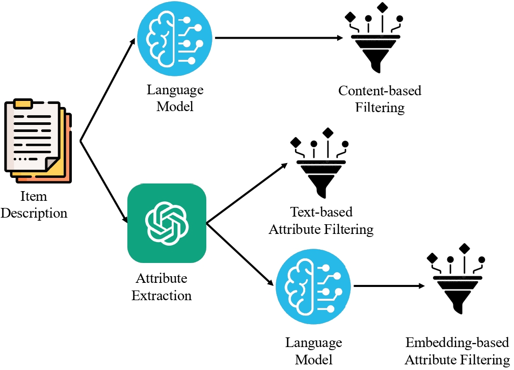

# Enhancing Recommendation Systems in Vietnamese E-commerce For Face Cleanser: A Comparative Study and Dataset Release

## Introduction
This repository introduces a Vietnamese dataset specifically designed for e-commerce recommendation systems, focusing on face cleanser products. With 369,099 user-item interactions, it offers valuable insights into personalized shopping experiences. We provide comprehensive baseline experiments, comparing content-based and attribute-based filtering approaches.

## Dataset
The dataset has 2244 items and 369,099 reviews from 304,708 users. To extract useful attributes from the product descriptions, an attribute extraction stage is performed using InstructGPT. 
Link to data: https://drive.google.com/drive/folders/1AvR71nHxK81DEtwFBAJzYDyBAou4YgmQ?usp=sharing

## Requirements
Install Elasticsearch follow: https://www.elastic.co/guide/en/elasticsearch/reference/current/install-elasticsearch.html

    pip install -r requirements.txt

## Content-based filtering
Content-based filtering is a baseline approach employed in this study. Four pre-trained models are utilized to extract embeddings from processed item descriptions, namely TF-IDF, BLIP, PhoBERT, and OpenAI Ada24. The code for Content-based filtering is in **src/Content_based_filtering.ipynb**

## Content-based filtering with Popularity score
we investigate the impact of item popularity on the content-based filtering approach. The popularity score, represented by the normalized number of times an item has been sold, is integrated into the content-based filtering process. After calculating the cosine score between the candidate embedding and the purchased item embedding, the final relevance score is determined using the following formula. The code for Content-based filtering with Popularity score is in **src/Attribute_embedding_based_filtering.ipynb**

Relevance_score = 𝛼 * Cosine_Score + 𝛽 * Popularity_Score

## Attribute-based filtering with text
Attribute-based filtering is performed on Elasticsearch with two versions: text and embedding based filtering. In the text-based approach, the textual attributes of all items are indexed within Elasticsearch. The data for indexing is on file **dataset/attribute_text_filtering.csv** and the code to index is in **src/ingest_elastic_attribute_text.py**. When attributes of purchased items are provided to Elasticsearch, it identifies similar items by leveraging the BM25 algorithm for searches on each attribute. The resulting scores from these searches are combined through a weighted average, generating a list of similar items along with their relevance scores. The code to perform text-based filtering is on **src/Attribute_text_based_filtering.ipynb**.

## Attribute-based filtering with Embedding
In this approach, called embedding-based attribute filtering, textual attributes undergo embedding using OpenAI Ada2. The embeddings are then dimensionally reduced for efficient Elasticsearch indexing. The data is **dataset/attribute_embedding_filtering.json**. Recommendations are generated by calculating cosine similarity between attribute embeddings of purchased and candidate items. The resulting cosine score, combined with popularity score, produces a ranked list of candidates. The code for recommending by embedding-based attribute filtering is in **src/Attribute_embedding_based_filtering.ipynb**.

